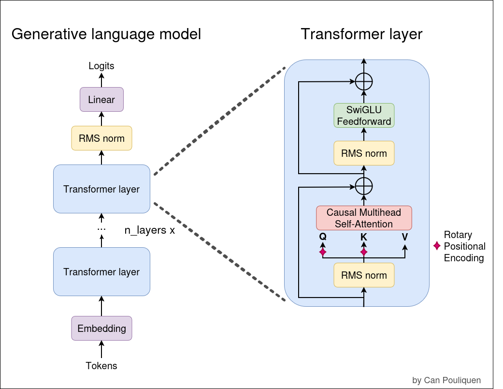

# Tiny LLaMA:
This is an ongoing project where I'm building a small LLaMA-like LLM from scratch.

My goal is to understand in details what's under the hood of these models so I tried to make the code as reusable as possible for future reference.

**NB:** I'm essentially following the project structure of Stanford's CS-336. Check out my Tiny Tokenizer repo for an implementation of a BPE tokenizer.

  <table>
    <tr>
      <td align="center"><h2><b>LLaMA</b>  (Meta)</h2></td>
      <td align="center"><h2><b>Tiny LLaMA</b>  (this repo)</h2></td>
    </tr>
    <tr>
      <td align="center"></td>
      <td align="center"></td>
    </tr>
  </table>

---
#### Trivia:
Modern [LLaMA-like variants](https://arxiv.org/pdf/2302.13971) of Transformer models are similar in essence to the decoder block of the original Transformer by [Vaswani et al., 2017](https://arxiv.org/pdf/1706.03762), with some architectural differences that have been observed to perform better throughout the years.

These namely include:

1. Pre-normalization instead of post-normalization.
2. Normalization by [RMSNorm](https://arxiv.org/pdf/1910.07467) instead of classic Layer Normalization.
3. [SwiGLU](https://arxiv.org/pdf/2002.05202) feedforward sub-layer instead of standard ReLU DNNs.
4. [Rotary Positional Encoding](https://arxiv.org/pdf/2104.09864) instead of absolute positional encoding.

      <td align="center"></td>

---
#### Work In Progress:

1. Support for gradient accumulating + checkpointing
2. Support for different parallelism degrees (DP as a start and eventually others)
3. Efficient inference pipeline, support for KV-cache

#### Longer-term wishlist:

1. Support for sliding window attention
2. Support for MoE variants
3. Support for Flash Attention
4. Add here your wishlist
